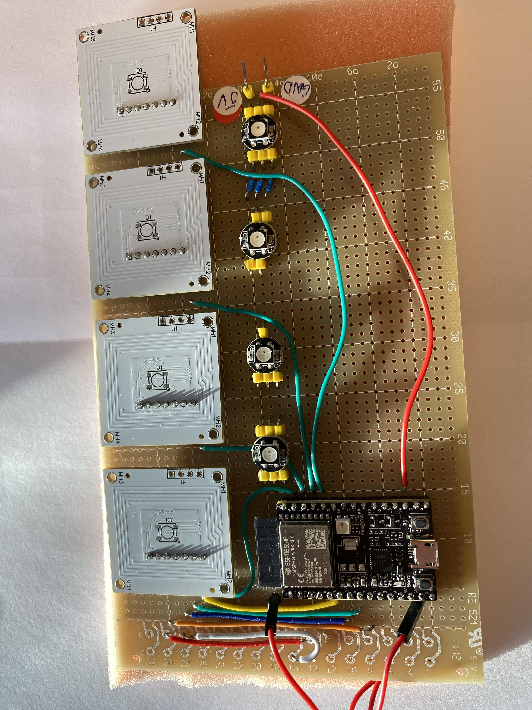
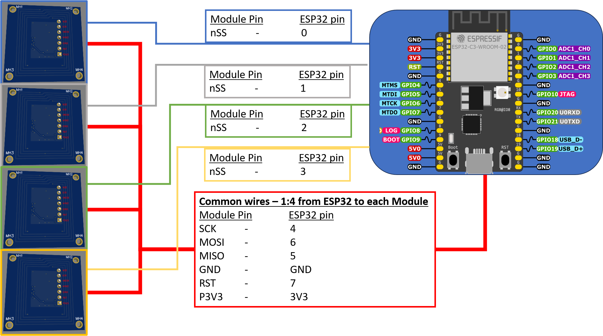
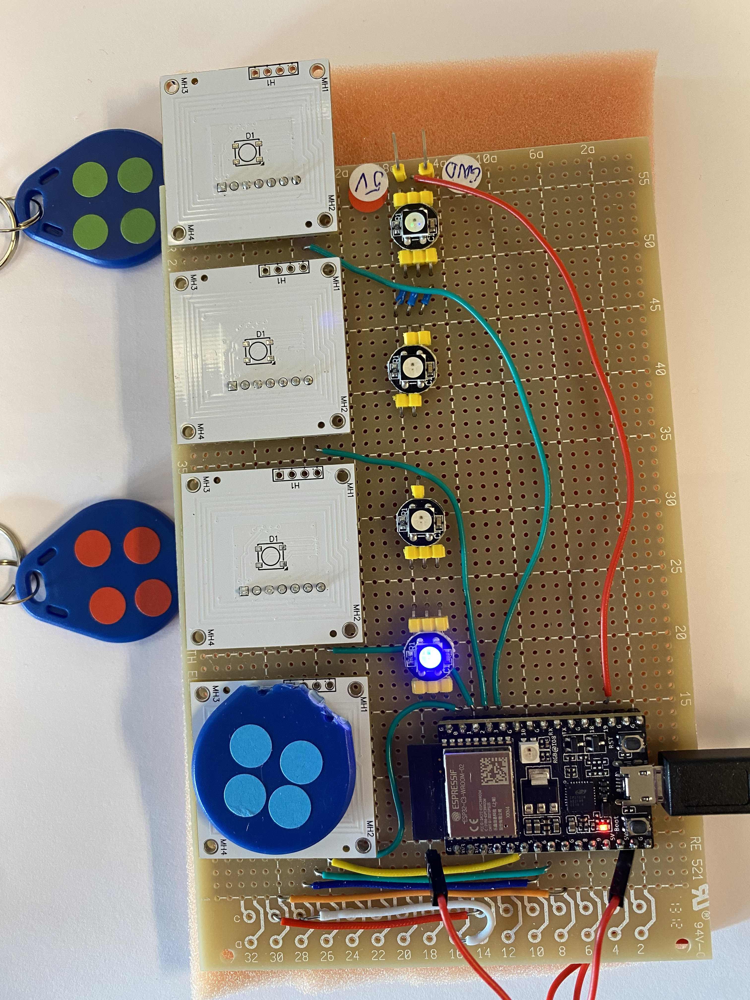
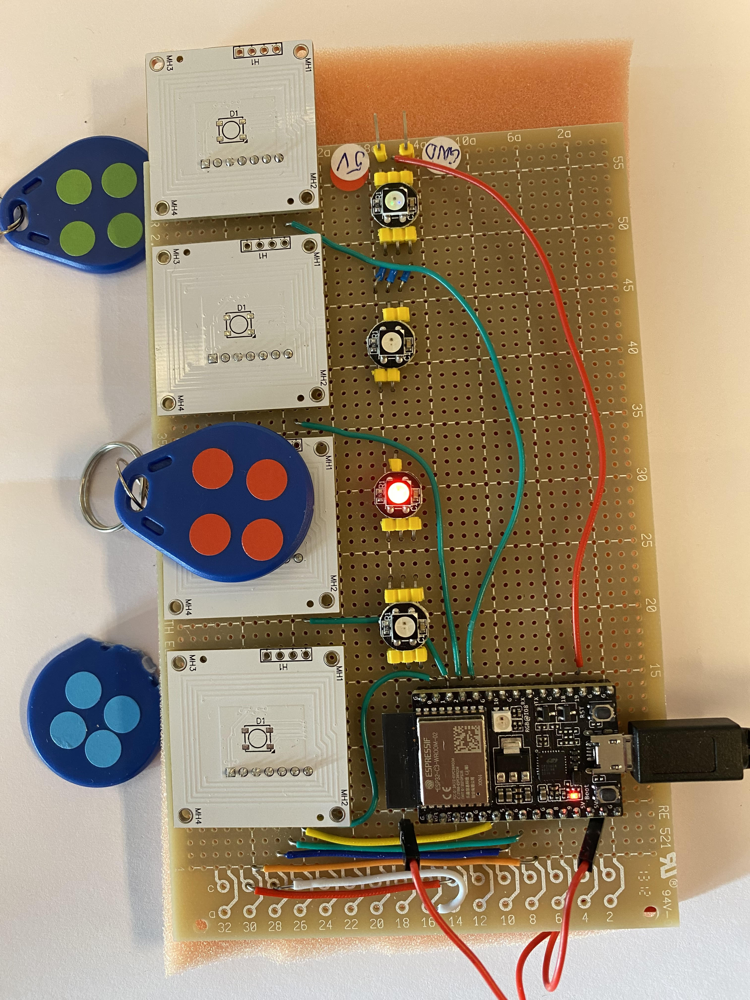
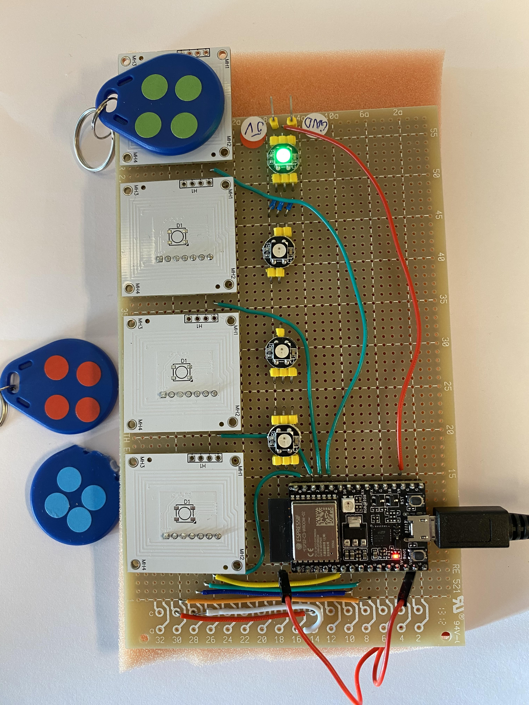

# Multiplexing-MFRC522-NFC-Modules: Readme & Developers Blog
NFC reading from 4x MFRC522 Modules on the same SPI bus from an ESP32


- A general description of the project:
  - _An ESP32 that multiplexes 4x of my custom desighned MFRC522 NFC modules, and uses RGB LEDs to indicate status_
  - _See my other repo, [Custom MFRC522 Board Design](https://github.com/palcan/Custom-MFRC522-Board-Design), for details on the custom designed MFRC522 NFC module_

- The project status:
  - _The project is finished, and intended to be reused, in some form, in a new project for multiplexing the frontend of one of the modules to 8x antennas. This project that can be found in a new repo some time in the future. The code in this repo will not be further updated._
     
- The requirements on the development environment for integration:
  - _I've used plain Aurdiono IDE (version 1.8.13) for the code. The code should work fine with any ESP32 board that has HW SPI. The custom MFRC522 module I made can be interchanged with the commonlys sold RC522 and RC522 MINI modules. The LEDs are the common WS2812B type, that can be interchanged with any other LED strips based on the WS2812B, such as neopixels_
  
- A guide to installation and use:
  - _The Arduino IDE downloads and use is extensively documented by Arduino.cc._
  - _The entries in the code where the red, blue and green tag ID's are set must be changed to the IDs of your own tags that you will be using_
  - _The specs for the ESP32 devboard I've used here can be found at https://docs.espressif.com/projects/esp-idf/en/latest/esp32c3/hw-reference/esp32c3/user-guide-devkitc-02.html._
  - _As stated earlier, the NFC modules can be bought all over the internet, and the pinout is typically printed on the modules_
  - _The library in use can be found through normal library search in the Arduino IDE (if you don't know how, there's info on Arduino.cc that explains that much better than me). The l\ink to the library Github page is https://github.com/miguelbalboa/rfid/tree/master._

- A list of technology used and any links to further information related to this technology:
  - _Much of the technology used (what we can call technology in this context) is readily available in uncounted sources a quick google search away. Keywords are_
    - _SPI_
    - _ESP32_
    - _Arduino IDE_
    - _Neopixel_
  - _For a deeper understanding of NFC there's multiple primers out there that can be helpful, I used the educational material available from NXP and STMicro quite a bit, and read through a few of the examples on connecting ESP32 and Arduino to RC522 (Lots of videos on Youtube on this)_

- Known bugs and any bug fixes:
  - _The first version I made of the custom board had a header H1 and a WS2812B RGB LED on as well. I've later removed those. You'll se the unpopulated footprints of them on the modules used in this project, while they are not present in the schematic shown._
  - _It is a bit unfortunate to place a through hole header where I did, as it protrudes up on the surface where the tag should be placed. If there will be a later revision of the PCB, I might move it all the way to the board edge, or rearrange the component placement enough to find board space for a SMD header_
  - _If there will be a later revision of the PCB, I'd print the signal names on the silkscreen next to the header pins. It was a bit unnecessarily annoying to have to check my notepad all the time to see which pin was which signal_
    
- FAQ section with all previously asked questions:
  - _Nobody has asked anything yet...!_
 
- Copyright and licensing information:
  - _See the license file in this repo_

  
## Table of Contents
[Introduction](#Introduction)  
[Design](#Design)  
[Test](#Testing-multiplexing-of-the-MFRC522-NFC-reader)  
[Code explanation](#Code-explanation)  

## Introduction
I've just recently dived into designing my own NFC frontend + antenna, and got it to work with some code on an ESP32 microcontroller. I thought it was the next logical step to test multiplexing multiple of these through the SPI bus, but didn't want to clutter the original repo where the design of the custom module was detailed, and I felt solving multiplexing multiple modules was worth it's own standalone solution space. I already had a few of the custom modules lying around from my original design order (see my other repo, [Custom MFRC522 Board Design](https://github.com/palcan/Custom-MFRC522-Board-Design), for all the details on the custom designed MFRC522 NFC module) and an extra ESP32 development board and some discrete WS2812B LEDs breakout PCBs, so all that was needed was to cobble it together on a breadboard. 

I re-used the colorcoded tags from the original project and altered the code to use external LEDs intstead of the builtin LED on the development board, and it worked almost perfectly. I had to add in the reset of module after a successful read, as otherwise I experienced some unexplained hangups (the module stopped responding, and halted the whole program... Probably some error with unfinished reading of a tag that were stuck waiting for data that never came. Or something else. Who knows.) 

[Back to Table of Contents](#Table-of-Contents)  

## Design
The breadborded "beauty". I ran out of wires at my desk, so it's not very consistent in wire lengths and coloring scheme. But I added a wiring list below that details which pins are connected where. 



*Breadboarded ESP32 with 4x LEDs and 4x MFRC522 PCBs*



*Wiring together the ESP32 and 4x MFRC522 PCBs. LEDs are unfortunately not shown here*

[Back to Table of Contents](#Table-of-Contents)  

## Testing multiplexing of the MFRC522 NFC reader

The following images and gif show in sequence that the different tags all are recognized independently of which reader is being used, and that there's no problem reading multiple tags when present. The color of the LEDs is set to match the color coding on the tags, and that matches without error. 



*Testing the recognition of the blue tag*



*Testing the recognition of the red tag*



*Testing the recognition of the green tag*


*Testing the recognition of all the three tags simultanously -gif-*

[Back to Table of Contents](#Table-of-Contents)  

## Code explanation

Please see the reposirory folder "Code" for the the full code where the snippets and blocks below are copied out from. I have in general re-used some of the description from the single module repo (see [Custom MFRC522 Board Design](https://github.com/palcan/Custom-MFRC522-Board-Design)) and added on with extra description for the sections where it is changed.  

The first block is basically just including the necessary external libraries used in the program. Note that the neopixel library is necessary to include to control the WS2812B LEDs. Alternatively the FastLED library would've worked as well. The SPI library lets you use the built in SPI bus for this ESP32 dev board, and the MFRC522.h library gives the abstraction layer functions you use to talk to the MFRC chip on the NFC module. 

```
#include <SPI.h>
#include <MFRC522.h>
#include <Adafruit_NeoPixel.h>
```

The reset pin for the MFRC522 chip is not part of the SPI bus, but is necessay to define before initializing the MFRC522 instance, so must be set at this section. The same goes for the SS pins (although those _are_ part of the SPI bus). It is defined separately from the SPI bus to allow for defining multiple SS pins when you have more than one device on the SPI bus. We are also defining the number of readers here - it gives simplifies scaling up later, as the loop can be set to loop over fewer reader modules with just changing this value (or more, just make sure enough SS pins are defined as well). Finally, we need to choose which pin we're driving the LED dataline from, and how many LEDs there are in the string, as the WS2812B LEDs are serially wired together.  

```
#define RST_PIN         7       // Configurable, not part of ESP32 SPI hardware pins
#define SS_1_PIN        0       // Configurable, not part of ESP32 SPI hardware pins
#define SS_2_PIN        1       // Configurable, not part of ESP32 SPI hardware pins
#define SS_3_PIN        2       // Configurable, not part of ESP32 SPI hardware pins
#define SS_4_PIN        3       // Configurable, not part of ESP32 SPI hardware pins
#define NR_OF_READERS   4       
#define LED_PIN         19
#define LED_COUNT       4
```

The MFRC522 chips are all instantiated here into an array, but not yet with the reset and SS pins as arguments, as we'll do that later at setup. The instances consists of multiple datafields that are updated whenever the chip is read. Since it is created here at the global workspace, it will be accessible anywhere in this program. The SS pins is placed into an array as it lets us loop over them in the same way as the MFRC522 instances.

```
byte ssPins[] = {SS_4_PIN, SS_3_PIN, SS_2_PIN, SS_1_PIN};           // Array of Slave Select pins for later use in cycling through with for loop
MFRC522 mfrc522[NR_OF_READERS];                                     // Create a MFRC522 instance for each of the readers we have
```

We're using the neopixel library to instantiate our led-string object. The arguments are directly copied from the examples given in the library

```
Adafruit_NeoPixel strip(LED_COUNT, LED_PIN, NEO_GRB + NEO_KHZ800);  // Instatiate the strip of WS2812B LEDs we are hooking up
```

We're also pre-defining the ID's of the tags we want to read as global values, so that they can be used whenever and wherever we need them. As the ID's consist of 4x bytes, we need to define a byte array to hold them. And since we have multiple, we have created a 2D array such that it is easier to loop over them. This helps us as we also create an arry of colors where the index of the ID tag corresponds to the color we want to show to indicate postive ID

```
byte allowedID[3][4] =                                              // The limited set of recognized unique IDs of the tags I'm using
  {
    {0x90, 0x6A, 0xCF, 0x25},   // ID0 
    {0x11, 0x7C, 0x5D, 0x26},   // ID1    
    {0x90, 0xD3, 0x11, 0x25},   // ID2 
  };   
uint32_t color_matching[3] =                                      // Colors matching the set of recognized unique IDs of the tags I'm using
  {
    strip.Color(  0,   0, 255), // Blue    
    strip.Color(  0,   255, 0), // Green
    strip.Color(  255,   0, 0), // Red
  };
```

Although quite a bit is happening in the setup section, most of it is fairly straightforward, and we will tackle it in three chunks. The Serial.begin line starts serial communication with the ESP32 at a predefined datarate of 9600 baud. The need for setting a specific datarate is because UART does not provide it's own separate clock signal, meaning both ends of the communication need to agree on the clock rate beforhand. The while(!serial) sets the program to wait at this point until a serial terminal is opened. (So, beware, if you don't open the serial terminal, you won't be able to start reading the tags and seeing the LEDs respond. If you want this program to run from a battery or other power supply, and not be connected to a PC, you should remove the Serial parts of the program, as you will never be able to open a terminal and never proceed with the program). SPI.begin just starts up the SPI bus so that we can begin sending/receiving data over it.

```
void setup() {
  Serial.begin(9600);           // Initialize serial communications with the PC
  while (!Serial);              // Do nothing if no serial port is opened 
  SPI.begin();                  // Initialize the SPI bus
```

Next we tell the ESP32 to initialize the led-strip instance we previously created, and to turn off the LEDs in its neopixel array. Then we pre-define the brightness of all the pixels in the array so that later changes to the colors will all be at 20% of maximum brightness. This helps with not using more power than the ESP32 can source. (there's three colors in one pixel, red green and blue, and each color can draw 20 mA at maximum brightness, meaning each pixel can potentially sink 60mA. Only 4x pixels can then worst case sink 240mA!)

```
  strip.begin();                // INITIALIZE NeoPixel strip object (REQUIRED)
  strip.clear();                // Turn OFF all pixels ASAP
  strip.setBrightness(50);      // Set BRIGHTNESS to about 1/5 (max = 255)
```

As we discussed in the sections above, the mfrc522 instance is globally available, so we can call it here, and it has a set of functions and datafields that comes with it. Here we loop over the initializer function that starts up the specific instances of the mfrc522. Notice we use the indexed SS array together with the common reset pin as arguments, which tells the function to instantiate it with SPI interface (a different set of arguments would have told the function to use the I2C or UART interface instead). It's important to have begun the SPI bus before we initialize a mfrc522 instance. The delay that follows is to give the chip enough time to run all it's internal start up and set up and configuration routines before we start asking it to do stuff (before this, the only thing we could tell it was to start up, or initialize). We proceed with a call to the mfrc522 to tell us which firmware version it has loaded onto it. If the output we receive isn't garbage, we know we have started up the MFRC522 chips correctly. The PCD and PICC names are the industry names for reader and tag. PCD = Proximity Coupling Device. PICC = Proximity Inductive Coupling Card. Note that the terms PICC and PCD most often are used for NFC systems that reads tags based on the ISO14443 standard, and other names might be used in other circumstances.

```
for (uint8_t reader = 0; reader < NR_OF_READERS; reader++) {    // looking for MFRC522 readers
    mfrc522[reader].PCD_Init(ssPins[reader], RST_PIN);
    Serial.print(F("Reader "));
    Serial.print(reader);
    Serial.print(F(": "));
    mfrc522[reader].PCD_DumpVersionToSerial();
    delay(500);
```

The main superloop starts bu setting up a loop that cycles through each mfrc522 instance. It contiunes by checking a couple of things for the currently selected mfrc522 instance. First it just continoues with the next mfrc522 instance in the loop if there is no tags present on the current reader. Second, if there was a tag present, it tries to read in the data from the tag. If the data couldn't be read, it just continoues with the next mfrc522 instance in the loop. If data could be read, it continues down to printing the Unique ID of the tag to the serial monitor. It uses a helper function to print the UID, dump_byte_array, this function is explained in the last part of this section. The next two lines uses a custom lookup function to return a color, white if the tag is not recognized, a custom color based on our loopup table if a recognized tag was found, and updates the color of the LED nieghboring the current reader. The custom lookup function is also explained later in the last part of this section. Finally we reset the reader to avoid issues with it stalling or hanging. 

```
void loop() {

  for (uint8_t reader = 0; reader < NR_OF_READERS; reader++) {              // CYCLING THROUGH EACH READER TO CHECK IF ANY NEW TAGS ARE PRESENT

    if (mfrc522[reader].PICC_IsNewCardPresent() && mfrc522[reader].PICC_ReadCardSerial()) {

      Serial.println();
      Serial.print(F("Reader "));
      Serial.print(reader);
  
      Serial.print(F(": Card UID:"));                                         // Show some details of the PICC (that is: the tag/card)
      dump_byte_array(mfrc522[reader].uid.uidByte, mfrc522[reader].uid.size);
      Serial.println();
  
      strip.setPixelColor(reader, checkTagUID(mfrc522[reader].uid.uidByte));  // Update the color of the LED next to the current reader according to the tag present
      strip.show();
  
      mfrc522[reader].PICC_HaltA();                                           // Halt PICC
      mfrc522[reader].PCD_StopCrypto1();                                      // Stop encryption on PCD
  
      mfrc522[reader].PCD_Reset();                                            // Test soft reset
      mfrc522[reader].PCD_Init(ssPins[reader], RST_PIN);
    
      strip.clear();                                                          // Set all pixel colors to 'off'
      strip.show();   
    }
  }
}
```

That's almost it, only the helper functions are left. What this one basically does up in the main loop is taking the MFRC522 UID buffer as the first argument, as it contains the byte values of the UID. And then it takes the length of the UID buffer as the second argument (which is in this case 4, as the ID's for the tags are 4 bytes long). Then it steps through each byte and prints out each byte as text on the serial monitor.

```
void dump_byte_array(byte * buffer, byte bufferSize) {
  for (byte i = 0; i < bufferSize; i++) {
    Serial.print(buffer[i] < 0x10 ? " 0" : " ");
    Serial.print(buffer[i], HEX);
  }
}
```

The last helper function starts by setting white as the default color to return in case no ID match was found. I then uses the UID buffer of a mfrc522 instance that was given as an argument in the function, and compares it with each of the three IDs in the allowedID array using the memcmp function. The memcmp function is a standard C language function which reinterprets the objects pointed to by the first and second argument as arrays of unsigned char, and compares the first specified bytes (in the code below, we have 4 bytes) of these arrays. The function returns an integer, 0, if all bytes are equal. The index of the ID that was recognized is re-used to select a matching color from the color_matching array, and we then stop the for loop. 

```
uint32_t checkTagUID(byte * buffer){
  uint32_t color = strip.Color(  0,   0,   0, 255);         // std color, true white, as deffault return value
  for (int i = 0; i < 3; i++) {
    if (memcmp(buffer, allowedID[i], 4) == 0){
        color = color_matching[i];
        break;    
    }else{
      Serial.println("No Match");
    }
  }
  return color;
}
```

[Back to Table of Contents](#Table-of-Contents)  
